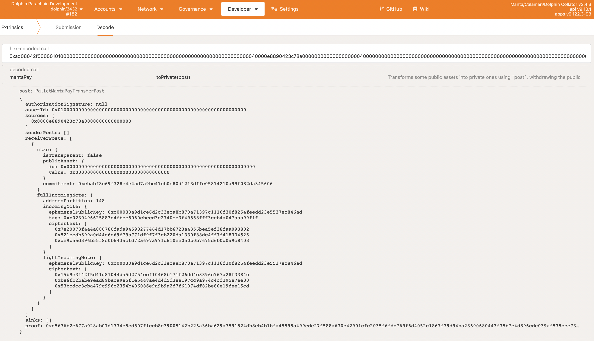
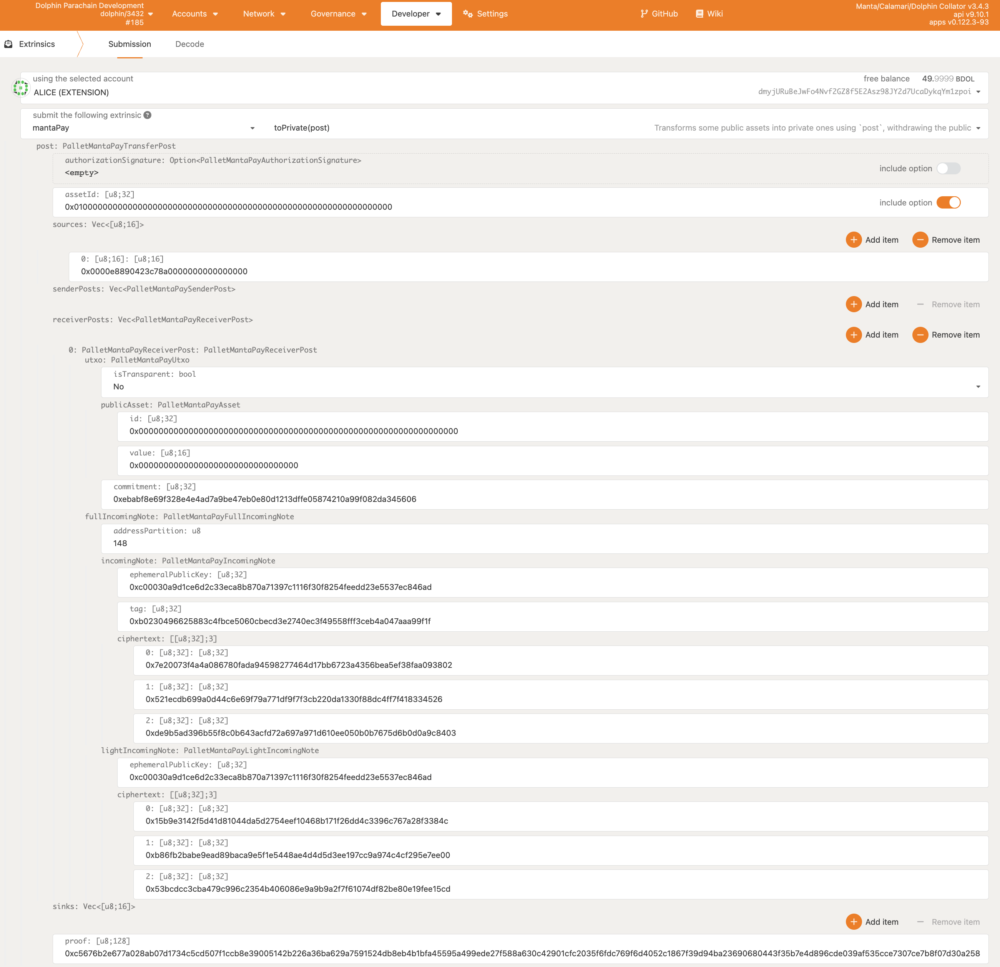
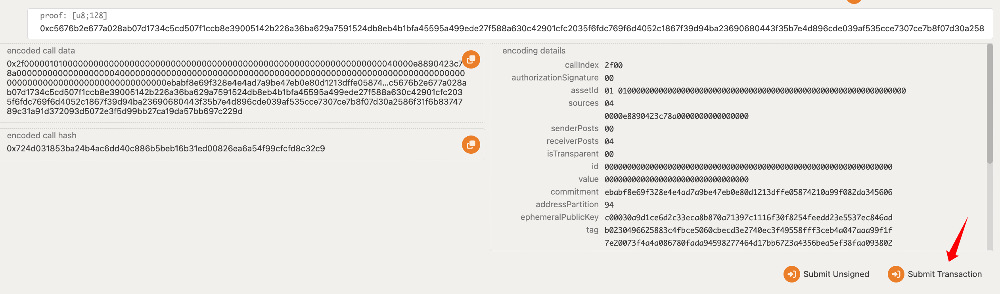

# Manta JS

This package implements a Javascript SDK for connecting with the Manta Network.

## How to Setup

1. Download and run latest Manta Signer, following its prompts - https://github.com/Manta-Network/manta-signer/releases/tag/v1.2.1
3. Import manta-js in your project's package.json as such:
```
"manta.js": "^0.0.7-dev0",
```
3. Check out how how to use the manta-js with the following examples: https://github.com/Manta-Network/sdk/blob/dev-pay-sbt/manta-js/examples/asset-webpack-ts/index.ts#L12-L23. There are examples for both MantaPay and MantaSBT systems.
   To run them go to the examples directory and use `yarn && yarn upgrade manta-js && yarn serve`

> If using sdk in a node.js environment please go to [Node Specific](#node-specific)

### Local Development

1. `git clone https://github.com/Manta-Network/sdk.git`
2. `cd sdk/manta-js/package`
3. `yarn`
4. `yarn build-all` (Note: go to [Node Specific](#node-specific) if running in node.js environment)
5. add `"manta.js": "file:/{LOCAL PATH OF sdk/manta-js/package}` to your project's package.json
6. `yarn upgrade manta.js` in your project's directory

# Usage

All methods are called through the `MantaPrivateWallet` class.

`manta-signer` must be installed and running.

> If running `manta-signer` on dev mode, you should use the following features: `features=unsafe-disable-cors,disable-restart`.

Refer to `/examples` for more thorough examples, and how to run them.

## Node Specific

If running in node.js the wasm module assumes browser DOM exists, you must export Web API functions from node in your project as seen below.

Node supported package is exported using the following path: `manta.js/node` see code snippit below.

This node package is only compatible with node16 and up, if using typescript you must set ```"moduleResolution": "node16"``` in `tsconfig.json` or as a compiler flag

```javascript
import { MantaPrivateWallet, Environment, Network } from 'manta.js/node'
import fetch from 'node-fetch';

// @ts-ignore
global.fetch = fetch;
// @ts-ignore
global.Headers = fetch.Headers;
// @ts-ignore
global.Request = fetch.Request;
// @ts-ignore
global.Response = fetch.Response;
```

## Initialization

The `Environment` flag specifies whether to connect to a local node, or the use an actual node from the network.

The `Network` flag specifies which network to connect to, either `Dolphin`, `Calamari` or `Manta`.

To switch between environments and networks, a new `MantaPrivateWallet` instance should be created.

```javascript
import { MantaPrivateWallet, Environment, Network } from 'manta.js';

const prodEnvironment = sdk.Environment.Production;
const mantaNetwork = sdk.Network.Manta;

const privateWalletConfig: PrivateWalletConfig = {
    environment: prodEnvironment,
    network: mantaNetwork,
};

const privateWallet = await MantaPrivateWallet.init(privateWalletConfig);
await privateWallet.api.isReady;
```

`PrivateWalletConfig` has several optional arguments:

- `loggingEnabled`, whether or not non-error logging to console should occur, set by default to `false`.
- `maxSendersPullSize`, set by default to `4096`.
- `maxReceiversPullSize`, set by default to `4096`.
- `pullCallback`, callback function after a pull has occured, set by default to `null`.
- `errorCallback`, callback function after an error has occured, set by default to `null`.

## Transacting

After initialization of the `MantaPrivateWallet` class, `initialWalletSync()` must be called before any transactions are made.

After every single transaction, to get the latest data from the ledger, `walletSync()` must be called.

A PolkadotJS `Signer` and public PolkadotJS `Address` should be provided to every function that requires transacting. Below is an example of how to get these values, this example assumes that the Polkadot JS extension is installed and contains an existing account.

### Polkadot JS Transaction Parameters

```javascript
import { web3Accounts, web3Enable, web3FromSource } from '@polkadot/extension-dapp';

// Get Polkadot JS Signer and Polkadot JS account address.
const getPolkadotSignerAndAddress = async () => {
    const extensions = await web3Enable('Polkadot App');
    if (extensions.length === 0) {
        throw new Error("Polkadot browser extension missing. https://polkadot.js.org/extension/");
    }
    const allAccounts = await web3Accounts();
    let account = allAccounts[0];

    const injector = await web3FromSource(account.meta.source);
    const polkadotSigner = injector.signer;
    const polkadotAddress = account.address;
    return {
        polkadotSigner,
        polkadotAddress
    }
}
```

Below is an example of how to transact using fungible tokens, there are four main methods that `manta-pay` provides:
- `toPrivateSend(asset, amount, polkadotSigner, polkadotAddress)`
- `privateTransferSend(asset, amount, receiver, polkadotSigner, polkadotAddress)`
- `toPublicSend(asset, amount, polkadotSigner, polkadotAddress)`
- `publicTransfer(asset, amount, destinationAddress, polkadotSigner, polkadotAddress)`

> This example assumes the `polkadotAddress` already has associated public funds.

### To Private

This example converts 10 public MANTA tokens to 10 zkMANTA tokens.

```javascript
// MANTA token
const assetId = new BN("1");
const amount = new BN("10000000000000000000");

// Sync with most recent ledger state.
await privateWallet.initialWalletSync();

// Get zk address
const zkAddress = await privateWallet.getZkAddress();

// Get private balance of MANTA for given zk address
const privateBalance = await privateWallet.getPrivateBalance(assetId);

// Privatize 10 MANTA to 10 zkMANTA
await privateWallet.toPrivateSend(assetId, amount, polkadotSigner, polkadotAddress);

// Sync to get latest data after the transaction and check that it was successful.
await privateWallet.walletSync();

// The private balance of zkMANTA should be incremented by 10 units.
const newPrivateBalance = await mantaSdk.getPrivateBalance(assetId);
```

### Private Transfer

This example transfers 10 private private zkMANTA to another address.

```javascript
// MANTA token
const assetId = new BN("1");
const amount = new BN("10000000000000000000");

// Sync with most recent ledger state.
await privateWallet.initialWalletSync();

// Get zk address
const zkAddress = await privateWallet.getZkAddress();

// Private Transfer of 10 zkMANTA to another zk address
const exampleZkAddress = "3UG1BBvv7viqwyg1QKsMVarnSPcdiRQ1aL2vnTgwjWYX";
await privateWallet.privateTransferSend(assetId, amount, exampleZkAddress, polkadotSigner, polkadotAddress);

// Sync to get latest data after transaction and check that it was successful.
await privateWallet.walletSync();

// The private balance of zkMANTA should decrease by 10 units.
const newPrivateBalance = await privateWallet.getPrivateBalance(assetId);
```

### To Public

This example converts 5 private zkMANTA to 5 public MANTA.

```javascript
// MANTA token
const assetId = new BN("1");
const amount = new BN("5000000000000000000");

// Sync with most recent ledger state.
await privateWallet.initialWalletSync();

// Get zk address
const zkAddress = await privateWallet.getZkAddress();

// Get private balance of MANTA for given zk address
const privateBalance = await privateWallet.getPrivateBalance(assetId);

// Convert 5 zkMANTA back to MANTA
await privateWallet.toPublicSend(assetId, amount, polkadotSigner, polkadotAddress);

// Sync to get latest data after transaction and check that it was successful.
await privateWallet.walletSync();

// The private balance of zkMANTA should decrease by 5 units.
const newPrivateBalance = await privateWallet.getPrivateBalance(assetId);
```

### Manta Utilities

There also exists a `MantaUtilities` class with additional functions. Mainly for interacting publicly with the Manta ecosystem. This example demonstrates these functions. This example assumes the `MantaPrivateWallet` class has already been initialized, as well as `polkadotAddress` and `polkadotSigner`.

```javascript
import { MantaUtilities } from "manta.js";

// Get signer version, signer must be running.
const signerVersion = await MantaUtilities.getSignerVersion();

// MANTA token
const assetId = new BN("1");

// Get public balance of MANTA for `polkadotAddress`.
const oldPublicBalance = await MantaUtilities.getPublicBalance(privateWallet.api, assetId, polkadotAddress);

// Public transfer of 5 MANTA to `destinationAddress`.
const destinationAddress = "dmyhNmYL13N7ZKcVYqBQhvrk5kSfrKZUmrjX9vAaM4846bWKR";
const amount = new BN("5000000000000000000");
await MantaUtilities.publicTransfer(privateWallet.api, assetId, amount, destinationAddress, polkadotAddress, polkadotSigner);

// Public balance should now be 5 MANTA less that `oldPublicBalance`.
const newPublicBalance = await MantaUtilities.getPublicBalance(privateWallet.api, assetId, polkadotAddress);
```

### Sign and manually send transaction

In some cases you may not want to send transaction to the ledger through manta.js, thus you can get sign result after manta-signer has signed the transaction and send the transaction yourself. This is done by using the `toPrivateBuild`, `privateTransferBuild`, `publicTransferBuild` functions.

This example returns the signed transaction of `toPrivate` for 10 MANTA.

```javascript
const assetId = new BN("1");
const amount = new BN("10000000000000000000");

const env = sdk.Environment.Production;
const net = sdk.Network.Manta;
const privateWallet = await sdk.init(env,net);

const zkAddress = await privateWallet.getZkAddress();
console.log("The zk address is: ", zkAddress);

await privateWallet.initialWalletSync();

const initialPrivateBalance = await privateWallet.privateBalance(assetId);
console.log("The initial private balance is: ", initialPrivateBalance.toString());

const signResult = await privateWallet.toPrivateBuild(assetId, amount, polkadotSigner, polkadotAddress);

console.log("The result of the signing: ", JSON.stringify(signResult.transactions));
```

This can also be done for all other transaction types:

```javascript
const toPrivateSignResult = await privateWallet.toPrivateBuild(assetId, amount, polkadotSigner, polkadotAddress);
const toPublicSignResult = await privateWallet.toPublicBuild(assetId, amount, polkadotSigner, polkadotAddress);
const privateTransferSignResult = await privateWallet.privateTransferBuild(assetId, amount, zkAddress, polkadotSigner, polkadotAddress);
```

Then you can use the signResult to submit transaction by your self. Here is an example on how to verify the `toPrivateBuild` sign result is valid:

Copy the transaction to polkadot.js `Extrinsic` decode:



Switch to `Submission`:



Then submit transaction.



You should see your extrinsic show up on polkadot.js explorer. Then you will notice an increase in your private balance.

## zkSBT

zkSBT sdk is extension of manta-pay sdk, and add some custom logic, including:
- We have a pre-charge steps when reserve asset id of zkSBT.
- User mint zkSBT by provide metadata, the metadata of zkSBT can be image url or anything, but we have a size limit of metadata(Current is 300 length).

Developer should use sdk to mint zkSBT, because current we need `Signer` to generate `TransferPost` which contains lots of zkp proof information.

### Mint zkSBT

Here is a example of mint zkSBT steps:

1. initial wallet and signer.

> `getPolkadotSignerAndAddress` is the same as manta-pay sdk.

```js
    const privateWallet = await SbtMantaPrivateWallet.initSBT(privateWalletConfig);
    const polkadotConfig = await getPolkadotSignerAndAddress();

    await privateWallet.initialWalletSync();
```

2. reserve asest id before mint zkSBT.

```js
    const reserveSbt = await privateWallet.buildReserveSbt(polkadotConfig.polkadotSigner, polkadotConfig.polkadotAddress);

    await reserveSbt.signAndSend(polkadotConfig.polkadotAddress);
```

3. Mint zkSBT by provide start asset id, number of token to mint, and metadata list.

> Notice: due to zkp proof extrinsic size is large than normal transaction, we current support at least 5 zkSBT in one batch.

```js
    const numberOfMints = 2;
    const metadata: string[] = [];
    for (let i = 0; i < numberOfMints; i++ ) {
        metadata.push(`YOUR METADAT INFO ${i.toString()}`)
    }

    const sbtMint = await privateWallet.buildSbtBatch(polkadotConfig.polkadotSigner, polkadotConfig.polkadotAddress, assetId, numberOfMints, metadata);

    await sbtMint.batchTx.signAndSend(polkadotConfig.polkadotAddress);
```
